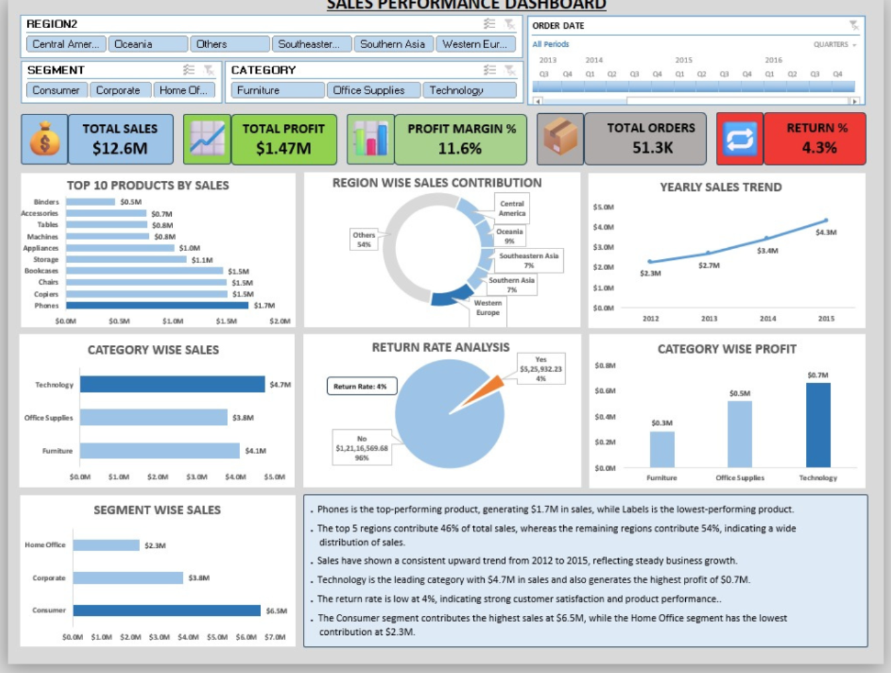
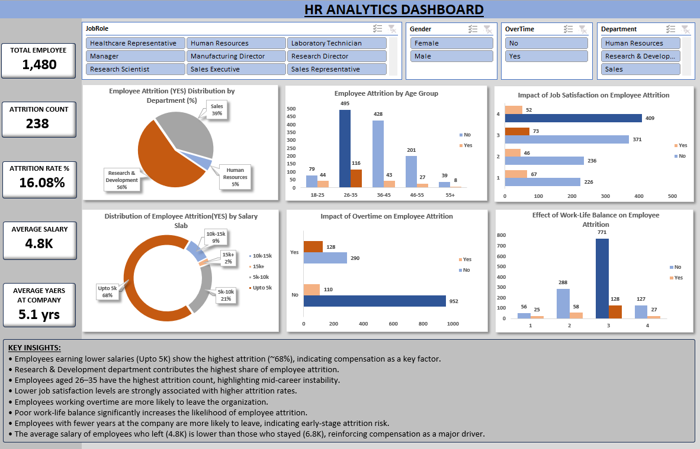

# 📊 Sales Performance Dashboard (Excel)

## Overview
Interactive dashboard built in Excel to analyze sales, profit, and trends.
This project demonstrates my ability to build interactive dashboards and extract business insights using Excel.
## Features
- KPIs: Sales, Profit, Margin, Orders, Return Rate
- Top Products Analysis
- Region Contribution
- Monthly Trend
- Slicers & Timeline

## Insights
- Phones top product
- Technology highest profit
- Return rate only 4%

## Tools Used
- Excel
- Pivot Tables
- Charts

## Preview

-----

## 📊 HR Analytics Dashboard

### 🔹 Overview
Interactive HR Analytics dashboard built in Excel to analyze employee attrition trends and identify key factors affecting employee turnover.

### 🔹 Key Metrics:
- Total Employees: 1,480  
- Attrition Count: 238  
- Attrition Rate: 16.08%  
- Average Salary: 4.8K  
- Average Years at Company: 5.1 years  

### 🔹 Insights:
- Employees earning lower salaries (Upto 5K) show the highest attrition  
- Research & Development department has the highest attrition  
- Employees aged 26–35 show the highest attrition  
- Lower job satisfaction is linked to higher attrition  
- Employees working overtime are more likely to leave  
- Poor work-life balance significantly increases attrition risk  
- Employees with fewer years at the company are more likely to leave  

### 🔹 Tools Used:
- Microsoft Excel  
- Pivot Tables  
- Charts & Dashboarding  
- Slicers for interactivity  

### 🔹 Files Included:
- HR Analytics Dashboard Screenshot  
- Excel Dashboard File (.xlsx)  

### 🔹 Preview

